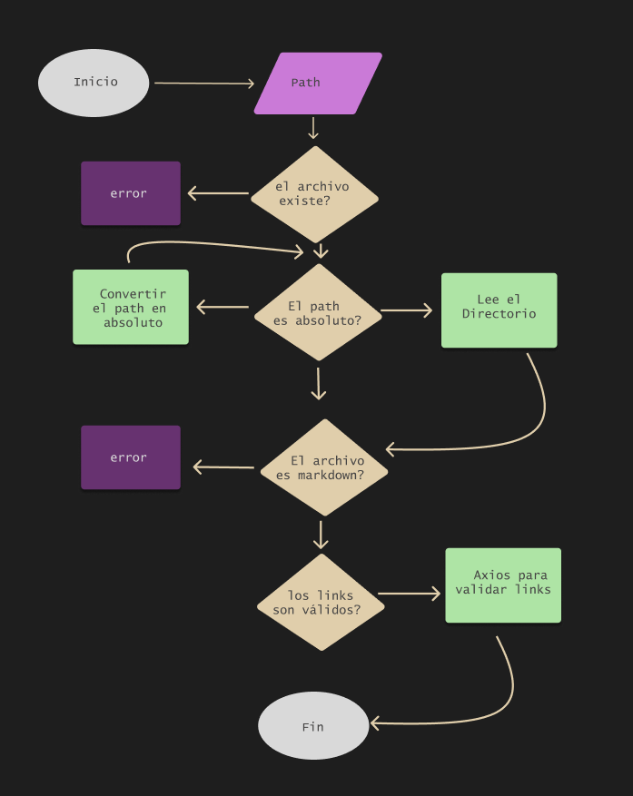
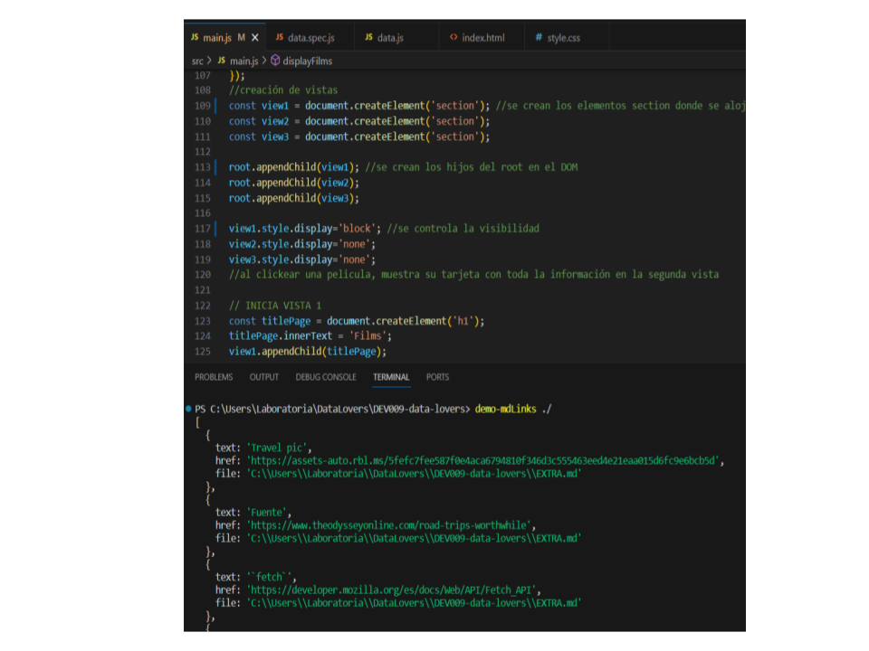
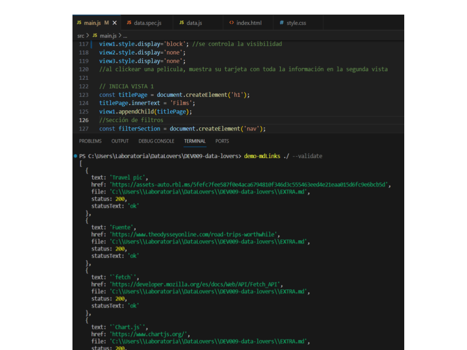
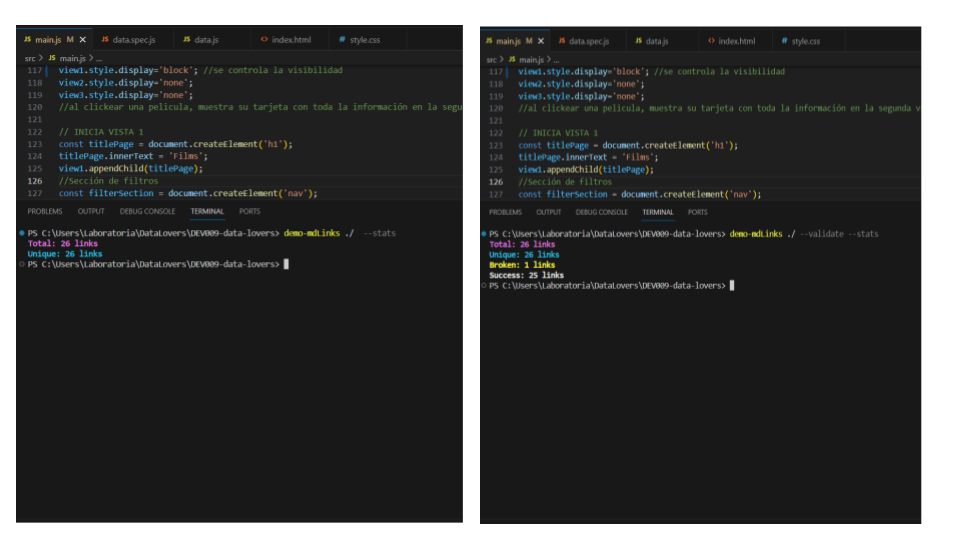

## Descripción

`mdlinks` es una librería desarrollada en Node.js para analizar archivos Markdown, extraer enlaces y entregar la validación de esos enlaces. 


## Diagrama de Flujo



## Características

* Busca dentro de un archivo o directorio, exclusivamente archivos Markdown, y entrega todos los enlaces/url que tiene ese archivo.
* Entrega información de cada enlace:

   **href**: la URL del enlace

   **text**: el texto descriptivo del enlace

   **file**: la ruta donde está el enlace
* Valida cada enlace con Axios para comprobar si está activo(status 200) o no(status 404)
* Libreria fácil de instalar a través de comando `npm` en la terminal


## Instalación

Esta librería está publicada y disponible como un módulo en GitHub, las usuarias pueden instalar e importar en otros proyectos. Al ejecutar la linea de comandos en la terminal se ejecuta y se puede comenzar a utilizar para revisar que todos los links de los archivos MarkDowm están activos. 

Copia y pega esta línea de comandos en tu terminal y se iniciará la instalación:

```bash

npm install CamiFlo/DEV009-md-links

```
## Funcionamiento


Para ejecutar mdLinks desde la terminal, hay que entregar a `demo-mdLinks` la ruta del archivo o directorio a analizar, según la siguiente sintaxis:

#### Archivo

```bash

demo-mdLinks /archivo

```
#### Directorio

```bash

demo-mdLinks ./directorio

```


#### Opciones

Para obtener el status de los links validados por Axios y un resumen de los links activos, rotos (broken) y el total, hay que agregar a la sintaxis los flags de las opciones:

**--validate**: retornará cada enlace que se encuentre en un archivo Markdown y mostrará su status (200 ó 404)  y statusText (OK o Fail), además de las propiedades href, text y file.
```bash
demo-mdLinks /archivo --validate

demo-mdLinks ./directorio --validate
```

**--stats**:  entrega 2 estadísticas sobre los enlaces encontrados: total de links y links únicos

```bash
demo-mdLinks /archivo --stats

demo-mdLinks ./directorio --stats
```

**--validate --stats**: al entregar ambas opciones, se entregan 4 estadísticas sobre los enlaces validados, incluidos: número total de enlaces, enlaces únicos, enlaces válidos (OK) y enlaces rotos (Fail). 
```bash
demo-mdLinks /archivo --validate --stats

demo-mdLinks ./directorio --vaalidate --stats
```
## Ejemplos
##### Cuando le entregamos a demo-mdLinks el directorio de un proyecto, se obtienen los links con 3 propiedades: href, text y file.

##### Cuando entregamos a demo-mdLinks un directorio más el flag --validate, nos entrega 5 propiedades de los links encontrados:href, text, file, status y statusText.

##### Entregamos el directorio y ambos opciones --validate y --stats, nos entrega un resumen del número de links totales, únicos, fallidos y válidos.




## Proceso de trabajo
Este proyecto está en la curricula de @Laboratoria, donde se dividió el trabajo en 5 hitos ,que se van encadenando en los procesos de producción, me permitió ir visualizando como es el trabajo en backend.

Lo primero fue ordenar el flujo de trabajo de la librería mediante un diagrama de flujo, donde se toman las decisiones de procesos de trabajos, inicio y final según la entrada de información.

Para ir cumpliendo con los hitos, hubo que leer documentación de Node.js y sus métodos para leer archivos, directorios, chequeo de rutas y y familiarizarse con el uso de la consola a falta de "DOM" y lo mismo con Axios, que es la tecnología que permite a mdLinks poder entregar información on-line del estado de las urls.


#### Tecnologias utilizadas
En este proyecto se construyó con JavaScript, Node,js, Jest, Axios para la validación de los links y Figma para el diagrama de flujo. La Animación de este ReadMe está hecha con Canva.

[](https://skillicons.dev)


:construction: Proyecto en construcción :construction:
